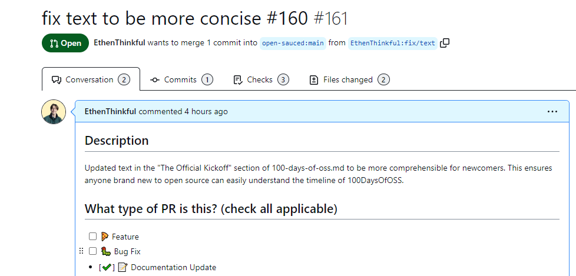
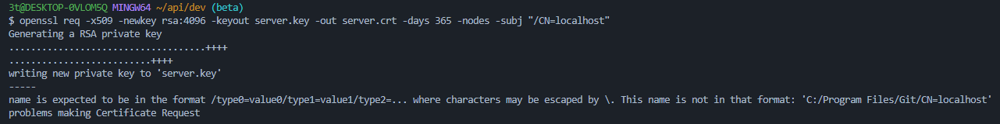

# 100DaysOfOSS Progress Tracker

## Template for Each Day

- **Project**: [Project Name]
- **Description**: [Briefly describe the project and your goals for the day]
- **Tasks completed**: [List the tasks you completed]
- **Challenges faced**: [Mention any challenges you encountered]
- **Resources used**: [Include any helpful resources or documentation links]
- **OpenSauced Highlight**: [Include a link, screenshot, or both if applicable]

# 100DaysOfOSS Progress Tracker

## Day 1

- **Project**: Getting started with 100DaysOfOSS
- **Description**: Getting familiar with Open Source Development so I can start contributing.
- **Tasks completed**: 
  - Read the "intro to open source" course by Open Sauced.
  - Completed my Open Sauced profile and reviewed public PRs of people contributing to Open Sauced.
  - Reviewed issues in app, hot, and api repositories. 
- **Challenges faced**: 
- Not knowing what first issue I should take on because a lack of "good first issues" within the Open Sauced repositories. Lack of knowledge of languages used in the Open Sauced api repository. 
- Not knowing what my next step should be (e.g. solve an issue, issue an issue, etc).
- **Resources used**: 
  - Intro to open source by Open Sauced (https://intro.opensauced.pizza/#/)
  - Intro to contributing to open sauced (https://docs.opensauced.pizza/contributing/introduction-to-contributing/)
  - 100 days of OSS (https://docs.opensauced.pizza/community/100-days-of-oss/#where-to-start)
- **OpenSauced Highlight**: [Include a link, screenshot, or both if applicable]

## Day 2

- **Project**: Getting started with 100DaysOfOSS part 2
- **Description**: Actually contributing!
- **Tasks completed**: 
  - Made my first contribution to open-sauced/guestbook by adding myself to the contributor list.
  - Raised an issue for text changes in open-sauced/docs.
  - took (.take) the above issue and issued my second PR as a fix to the issue.
  - Helped others get involved with open source through 100devs discord channel.
  - Attempted to get the api up and running locally.
  
  Did not get to:
  - Get involved more in the OSS community and the job hunt by applying for OSS internships/programs.
  - Raise an issue for load times (find repo that is causing slow load times) through a screen recording of the issue. See what I would need to learn to contribute to the fix.
  - Pick up my first issue (that I did not issue) that's already in the issues tab under "good first issue" and attempt to solve it (does not have to be an open-sauced repo).
  
- **Challenges faced**: 
- Ran into a specific problem when trying to generate self-signed certificates by using OpenSSL
  
- **Resources used**: 
  - Intro to open source by Open Sauced (https://intro.opensauced.pizza/#/)
  - 100 days of OSS (https://docs.opensauced.pizza/community/100-days-of-oss/#where-to-start)
  - 
- **OpenSauced Highlight**: [Include a link, screenshot, or both if applicable]
  - YAY: 
  - NAY: 

## Day 3

- **Project**: Cloning and getting the api up and running locally 
- **Description**: Follow steps to get it up and running and debug any errors that occur
- **Tasks completed**: 
  - Asked discord about where the API_DOMAIN is located in supabase
  - Raised an issue about setting up SSL certificates
  - Fixed issue on setting up SSL certificates (windows file path problem. Added "/" before the path to not access C directory)
  
- **Challenges faced**: 
- Fixing SSL keys and cert command 
- Installing psql to my command line 

## Day 4

- **Project**: Getting the Open Sauced api up and running locally (pt. 2) 
- **Description**: setting project up locally
- **Tasks completed**: 
- successfully installed psql to all paths needed
- raised issue describing a challenge I faced in the last step of project setup

- **Challenges faced**: 
-  could not migrate data into the database 

## Day 5

- **Project**: Migrating data into Open Sauced's local database
- **Description**: manipulating scripts to achieve successful migrations
- **Tasks completed**: 
- Successfully migrated data into the database!
- Closed issue

- **Challenges faced**: 
-  Manipulating the script to successfully migrate data. 

- **OpenSauced Highlight**:
Solution: 

## Day 6

- **Project**: Communicating with Senior Dev of Open Sauced
- **Description**: Thoroughly communicate bugs in local setup
- **Tasks completed**: 
- Communicated thoroughly by responding to a thread of comments regarding local setup complications.
- May be an OS problem (e.g. not having linux)
- Viewed Docker logs for identifying issues
- Successfully identified the issue in the Docker logs

- **Challenges faced**: 
-  Not knowing Docker in depth enough 

- **OpenSauced Highlight**: Communication!

## Day 7

- Interview Project 

## Day 8

- Interview Project (cont.)

## Day 9

- Interview Project (cont.)

## Day 10

- Interview Project (cont.)

## Day 11

- Interview Project (cont.)

## Day 12

- Interview Project (cont.)

## Day 13

- Interview Project (cont.)

## Day 13

- Interview Project (cont.)

## Day 14
**Project**: Installing WSL2 & Ubuntu for Open Sauced API development
- Successfully installed Ubuntu
- ready to re try process of setting up local dev!

## Day 15
- **Project**: Successfully set up Open Sauced API locally
- **Tasks completed**:
  - Successfully set up API locally
- **Challenges faced**: 
    - password authentication for connecting to the psql container in Docker

- **Resources used**: 
    - 100Devs help from experienced Docker dev

## Day 16
- **Project**: Run Open Sauced frontend locally and search for bugs/features
- **Tasks completed**:
  - Got familiar with the frontend a bit
  - Raised my first feature request in this repository!
- **Challenges faced**: 
    - Understanding Open Sauced's .env files

- **Resources used**: 
    - Open Sauced contributor's chat

## Day 17
- **Project**: Poke Booklets with Felipe
- **Tasks completed**:
  - Collaborated with felipe on finishing poke booklets

## Day 18
- **Project**: Poke Booklets with Felipe
- **Tasks completed**:
  - Collaborated with felipe on finishing poke booklets

## Day 19
- **Project**: Poke Booklets with Felipe
- **Tasks completed**:
  - Collaborated with felipe on finishing poke booklets

## Day 20
- **Project**: Random Open Source Ventures & Project Work
- **Tasks completed**:
  - Analyzed an issue with a button overflow on Open Sauced's frontend with Felipe and realized the persion who submitted a PR & closed the issue wasn't reflecting on the live site. We concluded that maybe this is because they've had a delay from the approver to update the live site.
  - Completed a multitude of features on poke booklets - most productive day yet collaborating with Felipe.
  - Someone assigned themselves the issue I raised on Open Sauced's frontend.
  - Geared up for tomorrow's goals with Felipe regarding code work.
